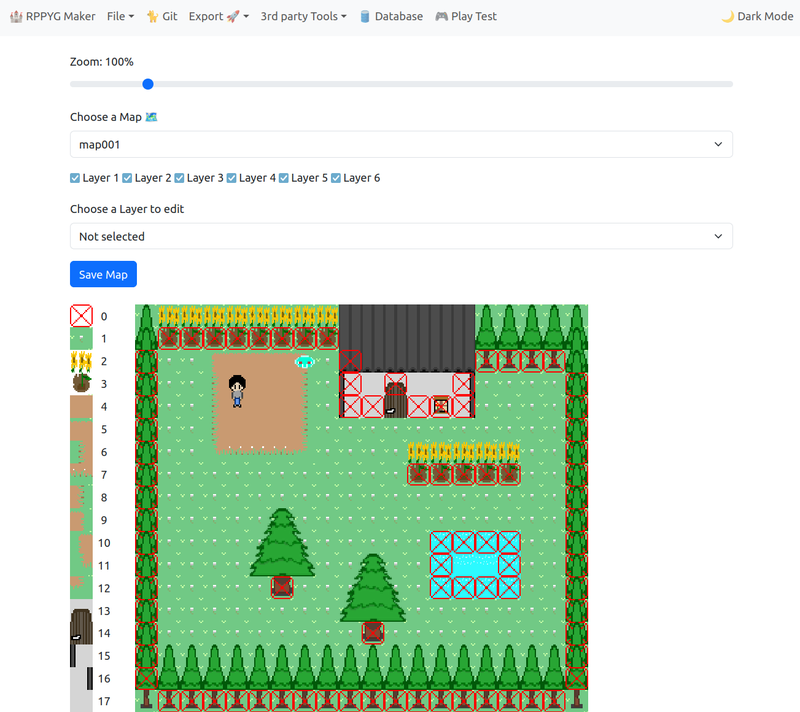
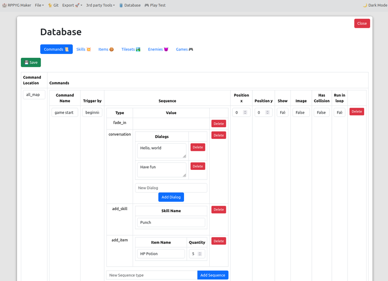
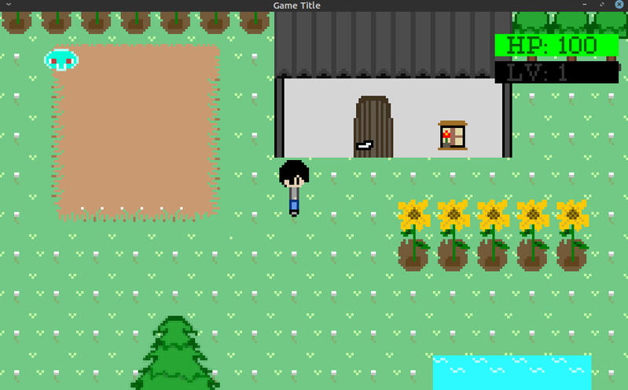
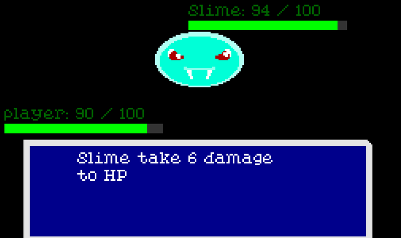

# RPPYG Maker

An alternative to RPG Maker, using Pygame and Flask.






### Installation

```bash
# Clone the repository
git clone https://github.com/kritserv/rpg-maker-clone

# Navigate to the project directory
cd rpg-maker-clone

# Install dependencies
pip install -r requirements.txt

# Run the application
python main.py
```

## Credits

- **Game Assets**: All game assets created by kritserv

## Contributing

Contributions are welcome!
